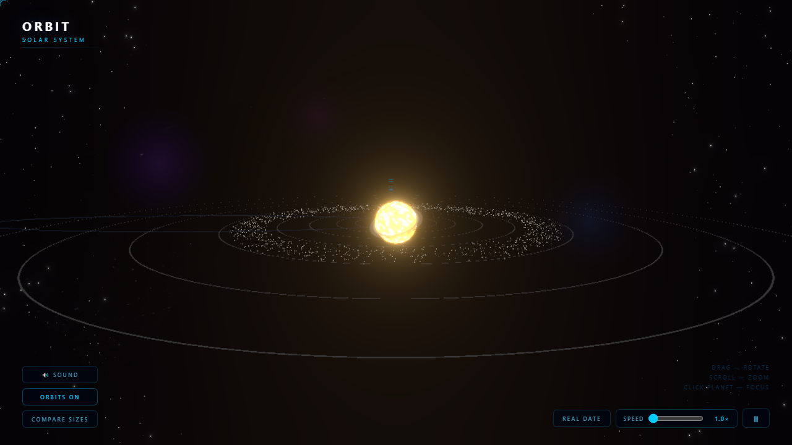

# Orbit

A photorealistic 3D solar system visualization built with React Three Fiber and Three.js.



## Features

- All 8 planets with real textures, axial tilt, and atmospheric effects
- Earth with day/night cycle, city lights, clouds, and Rayleigh scattering atmosphere
- Saturn with UV-corrected rings
- Glowing sun with animated noise shader and bloom post-processing
- Click any planet to smoothly pan the camera and view its info panel
- Orbit paths, time controls (speed up / pause), and size comparison mode
- Background music and hover/click sound effects
- URL state — share a link focused on any planet (`?focus=mars`)
- Custom space cursor

## Stack

| Package | Version |
|---|---|
| React | 18 |
| Three.js | 0.163 |
| @react-three/fiber | 8 |
| @react-three/drei | 9 |
| @react-three/postprocessing | 2 |
| GSAP | 3 |
| Vite | 5 |

## Getting Started

```bash
npm install
npm run dev
```

Open [http://localhost:5173](http://localhost:5173).

## Build

```bash
npm run build
npm run preview
```

## Controls

| Input | Action |
|---|---|
| Drag | Rotate view |
| Scroll | Zoom |
| Click planet | Focus camera + info panel |
| ← Solar System | Return to overview |
| Orbits button | Toggle orbit rings |
| Compare Sizes | Line up all planets at true relative scale |
| Time controls | Pause or speed up orbital motion |
